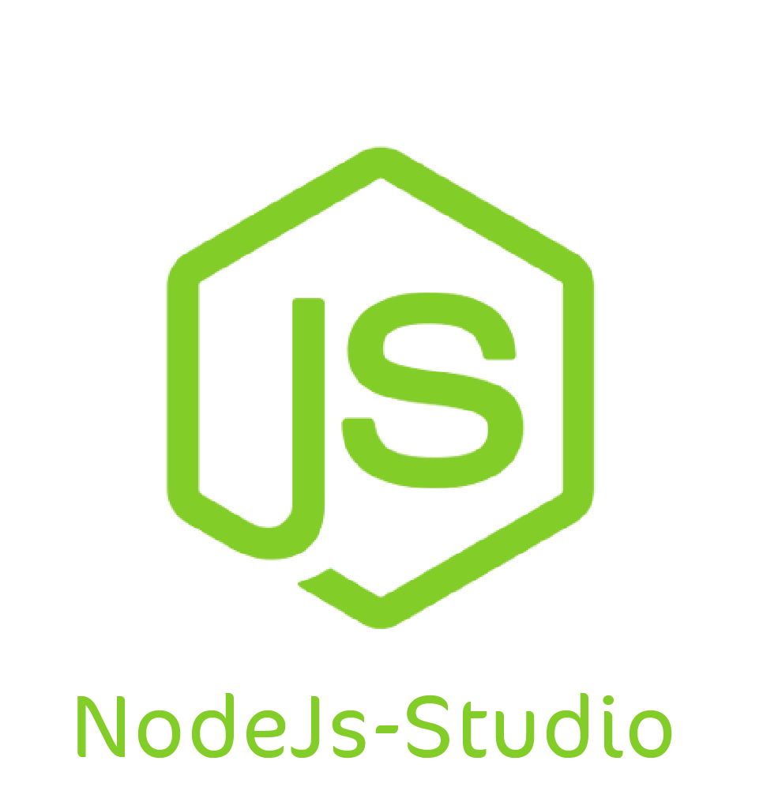

<p align="center" width="100%">
    
</p>


# Nodejs Studio
Node js package makes creating node js project dependincies files like Controllers,Entities and Repositories easier by executing a few instructions

## Dependencies
The first step is using npm to install the package and automatically update your package.json file, you can do this by running:
 ```
npm install nodejs-studio
 ```
 * Creat bin folder in root directoty
 

 
 * Inside bin folder create create-classes file 
 

 
 * Copy this to create-classes :
 ```
#!/usr/bin/env node

require = require("esm")(module /*, options*/ );
require("nodejs-studio").create(process.argv);
 ```
 * add this to package.json
  ```
   "bin": {
        "create": "bin/create-classes"
    },
    "keyword": [
        "create"
    ]
 ```
 
 ## Features
 * Create a package folder easily and quickly which contains :
   - Controllers
   - UseCases
   - Entities
   - Repositories 
 * Possibility to create a custom file type
  
 
 ## Usage
 * To creat package folder type this in cmd:
 ```
create --type package --name <your-package-name>
 ```
 or
 ```
 create -t package -n <packageName>
 ```
 
Then you can see that the package has been created:
 
 
 
* To creat controller type this in cmd:
 ```
create --type controller --name <controllerName>  --path <path>
 ```
 or
 ```
create -t c -n <controllerName>  -p <path>
 ```
* To see all commands type this in cmd:
 ```
create --type help
 ```
 ## Security
 If you discover any security related issues, please email them first to "mt880806@gmail.com", if we do not fix it within a short period of time please open a new issue describing your problem.
 ## Credits
 [Mohammed Taha](https://www.linkedin.com/in/-mohammed-taha)
