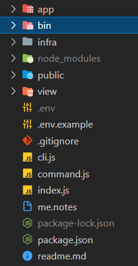
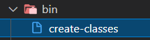

[](https://www.npmjs.com/package/nodejs-studio)

# nodejs-studio
## Dependency
The first step is using npm to install the package and automatically update your package.json file, you can do this by running:
 ```
npm install nodejs-studio
 ```
 * Creat bin folder in root directoty
 
 * Inside bin folder create create-classes file 
 
 * Copy this to create-classes :
  ```
#!/usr/bin/env node

require = require("esm")(module /*, options*/ );
require("nodejs-studio").create(process.argv);
 ```
 * add this to package.json
   ```
   "bin": {
        "create": "bin/create-classes"
    },
    "keyword": [
        "create"
    ]
 ```
 
 ## Usage
 * To creat package folder type this in cmd:
    ```
create --type package --name <your-package-name>
 ```
 * To creat controller type this in cmd:
 ```
create --type controller --name <controllerName>  --path <path>
 ```
 * To see all command type this in cmd:
   ```
create --type help
   ```
